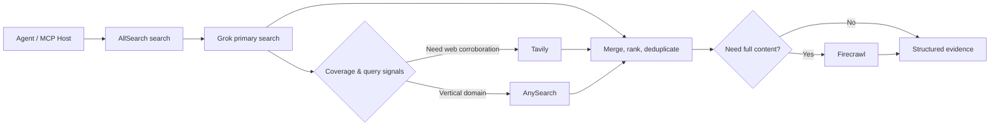

# AllSearch MCP

面向 AI Agent 的 **Grok-first 多源搜索 MCP**：先用 Grok 建立答案与引用基线，再按任务需要调用 Tavily、AnySearch 和 Firecrawl 补充证据。

AllSearch 适合接入 Pi、OpenClaw 或其他 MCP Host。它提供统一的搜索结果结构、Provider 路由记录、引用去重、垂直领域检索和网页正文抓取，并附带一个防止搜索结果撑爆上下文的 Pi Extension。

> **项目状态：** `v0.1.0`，已完成真实 Provider 与 MCP stdio 调用验证，适合本地使用和边用边调。搜索质量策略仍会继续迭代。

## 它解决什么问题

一个 Agent 的外部搜索通常不是“选一个搜索 API”这么简单：

- Grok 擅长搜索、理解问题并生成带引用的初步答案；
- Tavily 适合补充网页结果和做独立交叉验证；
- AnySearch 对 CVE、金融、学术、法律等垂直领域更有结构化优势；
- Firecrawl 适合在已经发现 URL 后抓取完整正文。

AllSearch 将这些能力收进一个 MCP，并保持明确的优先级：



### Provider 职责

| Provider | 在 AllSearch 中的职责 |
| --- | --- |
| Grok / xAI-compatible Responses | 默认主搜索、答案与引用基线 |
| Tavily | 网页补充、官方来源发现、`verify` / `deep` 交叉验证 |
| AnySearch | CVE、金融、学术、法律、健康、代码等垂直领域检索 |
| Firecrawl | 已知 URL 的正文抓取，不作为默认发现引擎 |

## 快速开始

### 1. 安装

要求：

- Python 3.11+
- 至少一个支持 `web_search` 的 OpenAI Responses-compatible Grok 端点
- Tavily、AnySearch、Firecrawl 按需配置

```bash
git clone https://github.com/Windrunner20/allsearch.git
cd allsearch

python3 -m venv .venv
source .venv/bin/activate
pip install -e '.[dev]'

cp .env.example .env
chmod 600 .env
```

### 2. 配置 Provider

编辑 `.env`。下面是最常用的配置项：

```env
# Grok primary search
ALLSEARCH_XAI_API_KEY=
ALLSEARCH_XAI_BASE_URL=https://your-responses-compatible-endpoint/v1
ALLSEARCH_XAI_RESPONSES_PATH=/responses
ALLSEARCH_XAI_MODEL=grok-4.5
ALLSEARCH_XAI_FALLBACK_MODELS=grok-4.3
ALLSEARCH_XAI_REASONING_EFFORT=low
ALLSEARCH_XAI_MAX_TOOL_CALLS=4

# Supplements
ALLSEARCH_TAVILY_API_KEY=
ALLSEARCH_ANYSEARCH_API_KEY=
ALLSEARCH_FIRECRAWL_API_KEY=
```

`.env.example` 包含所有可配置项。进程或 MCP Host 注入的环境变量优先于 `.env`。

<details>
<summary>Responses-compatible 端点配置</summary>

官方 xAI：

```env
ALLSEARCH_XAI_BASE_URL=https://api.x.ai/v1
```

使用其他 OpenAI Responses-compatible 网关时，只需替换 base URL、模型名称和 API key：

```env
ALLSEARCH_XAI_BASE_URL=https://your-gateway.example/v1
ALLSEARCH_XAI_RESPONSES_PATH=/responses
ALLSEARCH_XAI_MODEL=your-primary-model
ALLSEARCH_XAI_FALLBACK_MODELS=your-fallback-model
ALLSEARCH_XAI_REASONING_EFFORT=low
```

Responses 推理参数使用嵌套格式：

```json
{
  "reasoning": {
    "effort": "low"
  }
}
```

兼容网关会接收你的查询和凭据。请仅使用你信任的服务，并自行确认其隐私、计费和数据保留政策。

</details>

### 3. 运行健康检查

```bash
python - <<'PY'
import asyncio
from allsearch.config import load_config
from allsearch.orchestrator import Orchestrator

async def main():
    app = Orchestrator(load_config())
    try:
        health = await app.health()
        for provider in health.providers:
            print(provider.name, provider.configured, provider.state)
    finally:
        await app.aclose()

asyncio.run(main())
PY
```

预期能看到已配置 Provider，例如：

```text
xai True idle
tavily True idle
anysearch True idle
firecrawl True idle
```

### 4. 启动 MCP

stdio：

```bash
python -m allsearch --transport stdio
```

Streamable HTTP：

```bash
python -m allsearch \
  --transport streamable-http \
  --host 127.0.0.1 \
  --port 8000 \
  --path /mcp
```

MCP Host 的通用 stdio 配置大致如下；配置键名可能因 Host 而异：

```json
{
  "mcpServers": {
    "allsearch": {
      "command": "/absolute/path/to/allsearch/.venv/bin/python",
      "args": ["-m", "allsearch", "--transport", "stdio"],
      "cwd": "/absolute/path/to/allsearch"
    }
  }
}
```

密钥可以继续留在仓库目录的 gitignored `.env` 中，不需要复制到 Host 配置文件。

## MCP 工具

### `search`

统一搜索入口。

```json
{
  "query": "核实 Python 当前最新稳定版本和发布日期",
  "mode": "auto",
  "depth": "verify",
  "max_results": 8,
  "include_domains": ["python.org"],
  "fresh": true
}
```

返回包含：

- `answer`：Grok 主答案；
- `results` / `citations`：去重后的证据与引用；
- `route.stages`：实际调用了哪些 Provider、原因和延迟；
- `evidence`：唯一 URL、独立域名、跨 Provider 命中、抓取页数；
- `warnings` / `errors`：模型 fallback、Provider 错误和降级状态。

### `fetch`

通过 Firecrawl 抓取已知公共 URL 的正文，并进行 SSRF 目标检查。

```json
{
  "url": "https://example.com/article",
  "max_chars": 30000,
  "fresh": true
}
```

### `health`

查看 Provider 配置、熔断和缓存状态，不返回密钥内容。

```json
{
  "probe": false
}
```

## 搜索深度

| Depth | 行为 | 适合场景 |
| --- | --- | --- |
| `fast` | Grok 优先；证据不足时才补 Tavily；不自动抓正文 | 普通查询、当前版本、低延迟任务 |
| `balanced` | Grok 优先；按需 Tavily；高置信度垂直问题使用 AnySearch | 默认日常研究 |
| `verify` | Grok 后强制 Tavily 交叉验证；垂直问题加 AnySearch；有限 Firecrawl | 事实核验、多个来源、官方依据 |
| `deep` | 更完整的补充搜索与正文抓取 | 深度研究、需要原文的任务 |

所有深度都保持 Grok 先执行。Tavily 与 AnySearch 属于后续补充阶段，Firecrawl 只在发现 URL 后工作。

## AnySearch 垂直检索

AllSearch 会先读取目标领域的能力目录，再选择 `sub_domain` 和必填参数。

例如：

```text
CVE-2024-1234 的影响范围和修复建议
```

会被路由为：

```json
{
  "domain": "security",
  "sub_domain": "security.vuln",
  "sub_domain_params": {
    "type": "cve",
    "value": "CVE-2024-1234"
  }
}
```

适配器同时兼容 AnySearch 的旧版表格目录和当前分节 Markdown 目录，并会过滤非法 URL。

## Pi 集成：防止搜索撑爆上下文

仓库自带 Pi Extension：

```bash
mkdir -p ~/.pi/agent/extensions
ln -s "$(pwd)/integrations/pi" ~/.pi/agent/extensions/allsearch
```

重启 Pi，或在当前会话执行：

```text
/reload
```

检查状态：

```text
/allsearch-status
```

Pi 中会出现：

```text
allsearch_search
allsearch_fetch
allsearch_health
```

### 上下文预算

Pi Extension 不会把完整 MCP JSON 和网页正文直接放入模型上下文。

| 工具 | 单次摘要上限 | 单轮共享上限 |
| --- | ---: | ---: |
| `allsearch_search` | 8KB | 16KB |
| `allsearch_fetch` | 6KB | 16KB |
| `allsearch_health` | 4KB | 16KB |

当 Pi 当前上下文使用率超过 75% / 90% 时，单次摘要会自动收紧到 4KB / 2KB。

完整 MCP 响应保存到私有临时文件：

```text
/tmp/pi-allsearch-*/search.json
```

文件权限为 `0600`，目录权限为 `0700`。摘要不足时，Agent 可以通过 `read` 的 `offset` / `limit` 增量查看，而不是一次吞入完整结果。会话关闭时临时文件会自动清理。

> Pi Extension 与所有本地 Extension 一样，使用当前用户权限执行。只从你信任的仓库版本加载它。

## 运行与安全边界

- `.env`、虚拟环境、缓存和 Agent 临时文件均被 Git 忽略；
- Provider 错误在返回给 Agent 前会进行常见密钥模式脱敏；
- `fetch` 会拒绝 localhost、私有 IP、嵌入凭据和非 HTTP(S) URL；
- URL 合并会去除常见追踪参数并按规范化 URL 去重；
- 搜索和网页内容始终被标记为不可信外部数据；
- `ALLSEARCH_ALLOW_DEGRADED_SEARCH=false` 时，Grok 不可用会返回明确错误，而不是悄悄改成其他搜索结果。

## 测试

```bash
source .venv/bin/activate
pytest -q
```

当前测试覆盖：

- Provider 请求与响应契约；
- Grok 模型 fallback 和 reasoning 参数；
- AnySearch 两种 Markdown 格式；
- 路由、合并、缓存、熔断和 SSRF 检查；
- MCP 工具注册；
- Pi bridge 的严格字节预算和 artifact 路径保留。

真实 Provider 测试默认不在 CI / 普通测试中运行，以避免消耗额度和依赖外部网络。

## 已知限制

- 搜索排序和查询改写仍需要根据真实任务持续调优；
- Responses-compatible 网关的模型可用性、延迟和计费可能随时变化；
- 当前缓存仅为进程内存缓存，没有 Redis 或跨进程共享；
- HTTP 总 deadline 仍属于软预算，极端重试情况下可能超过目标时间；
- 当前没有 Docker 镜像、管理 UI 或第二次模型综合层。

## 参与贡献

欢迎提交 Issue 或 Pull Request。涉及 Provider 契约变化时，请附上脱敏后的响应结构或 fixture，不要提交真实 API key、完整私密查询或用户数据。

## License

项目元数据当前声明为 MIT。仓库尚未加入独立的 `LICENSE` 文件；正式分发或二次使用前，请先确认许可证文本。
